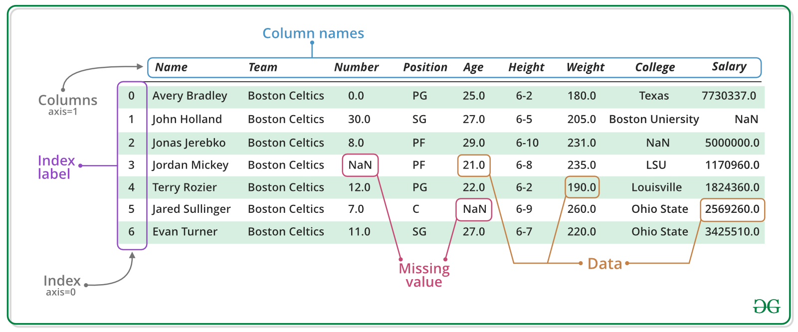

---
header-includes:
  - \usepackage[spanish]{babel}
  - \usepackage{svg}
  - \usepackage{float}
title: |
  {width=0.45in}  
  ENGIN 604 Introducción a Python para las Finanzas
author: "Análisis de Datos con Pandas - Pauta"
prof: "Gabriel E. Cabrera"
ta: "Alex Den Braber"
# due: "Jueves 11 de Marzo"
# submit: "engin604assignments@gmail.com"
# page: "5 páginas"
# bibliography: "latex/references.bib"
# biblio-style: "acm"
link-citations: yes
citecolor: blue
urlcolor: blue
linkcolor: blue
geometry: margin=0.75in
fontsize: 10pt
output: 
  bookdown::pdf_document2:
    toc: no
    highlight: "default"
    number_sections: yes
    fig_caption: yes
    dev: cairo_pdf
    latex_engine: pdflatex
    template: "Latex/template.tex"
nocite: '@*'
---

```{r setup, include=FALSE}
knitr::opts_chunk$set(echo = TRUE)
```

[{height=15px }](https://colab.research.google.com/drive/1ffcrrUse0JVJbi3DmU7K8XSVJH_x-UQA?usp=sharing)

La librería Pandas está pensada para análisis de datos del tipo tabular. No solo provee clases y funciones útiles, también permite aplicar funciones desde otras librerías como NumPy.

Existen dos tipos de estructuras fundamentales en Pandas:

Table: Estructuras Fundamentales 

| Tipo de objeto | Descripción                                  | Usado para                              |
|:---------------|:---------------------------------------------|:----------------------------------------|
| `DataFrame`    | Objeto de 2-dimensiones con índice (`index`) | Datos tabulares organizados en columnas |
| `Series`       | Objeto de 1-dimensión con índice (`index`)   | Serie (de tiempo) de datos única        |

Para importar Pandas:

```{python}
# se importa pandas
import pandas as pd 
```

# Series 

Una Series es un *array* de una dimensión que contiene una secuencia de valores (como en NumPy) y una etiqueta (*label*) denominada índice (`index`). Para crear una Series: 

```{python}
# se crea Series
obj = pd.Series([4, 7, -5, 3],                 # se define los datos
                index = ['a', 'b', 'c', 'd'])  # se especifica el índice 

# se verifica el obj
obj
```

# DataFrames

Un DataFrame es una estructura de 2-dimensiones con datos etiquetados (*labels*), índice en las filas como en las columnas. La columna potencialmente puede contener diferentes tipos de datos. Para crear un objeto `DataFrame`:

```{python}
# se crea DataFrame
df = pd.DataFrame([10, 20, 30, 40],              # se define los datos
                  columns = ['numbers'],         # nombre de columna 
                  index = ['a', 'b', 'c', 'd'])  # se especifica el índice 

# se verifica df
df 
```

Es importante notar que:

* Los datos están organizados en columna (puede tener nombres personalizados)
* Hay un índice que puede tomar diferentes formatos (e.g números, *strings*, etc).

Para acceder al índice:

```{python}
# extrae columna
df.columns
```

Se puede pasar una Series a un DataFrame:

```{python}
# serie a df 
obj_to_df = obj.to_frame()

# se le asigna el nombre de la columna 
obj_to_df.columns = ['numbers']

# verifica obj_to_df
obj_to_df
```

En resumen la estructura de DataFrame:

```{r, echo=FALSE, fig.pos = "H", fig.align='center'}

```

Para ver la documentación de la librería Pandas ir a: https://pandas.pydata.org/docs/

# Aplicación 

1. El archivo `gapminder.xlsx` y `gapminder.dta` contiene un extracto del proyecto Gapminder sobre expectativa de vida (`lifeExp`), PIB per cápita (`gdpPercap`) y población (`pop`), según país (continente). Utilizando la librería Pandas, cargue a su espacio de trabajo ambas bases de datos. Nombre uno de los dos `DataFrame` como `gapminder`. 

    ```{python, eval=FALSE}
    # importa pandas 
    import pandas as pd 
    
    # "lee" xlsx
    gapminder = pd.read_excel('gapminder.xlsx')
    
    # "lee" dta formato de stata
    pd.read_stata('gapminder.dta')
    ```

2. Muestre las 10 primeras y últimas observaciones de `gapminder`.

    ```{python, eval=FALSE}
    # muestra 10 primeras observaciones
    gapminder.head()
    
    # muestra 10 últimas observaciones
    gapminder.tail()
    ```

3. Genere un nuevo `DataFrame` que contenga solo los países del continente americano (`americas`) en el año 2007.

    ```{python, eval=FALSE}
    # extrae columnas
    gapminder.columns
    
    # extrae rl column index de la columna continent
    gapminder.columns.get_loc('continent')
    
    # extrae index
    gapminder.index
    
    # valores únicos de la variable continent
    gapminder.continent.unique()
    
    '''
    Seleccionar variables (columnas) de un DataFrame
    '''
    # forma 1: 
    # selecciona la variable continent como series
    gapminder.continent
    
    # forma 2: 
    # selecciona la variable continent como series
    gapminder['continent']
    
    # forma 3: 
    # selecciona la variable continent como series utilizando loc (se puede seleccionar filas)
    gapminder.loc[:,'continent']
    # selecciona la variable continent como series utilizando iloc (se puede seleccionar filas)
    gapminder.iloc[:,1]
    
    # forma 4: 
    # selecciona la variable continent y lifeExp utilizando loc (se puede seleccionar filas)
    gapminder.loc[:,['continent','lifeExp']]
    
    # selecciona la variable continent y lifeExp utilizando iloc (se puede seleccionar filas)
    gapminder.iloc[:,[1,3]]
    
    # forma 5: 
    # selecciona las variables desde continent hasta pop (la incluye) 
    # utilizando loc (se puede seleccionar filas)
    gapminder.loc[:,'continent':'pop']
    # selecciona las variables desde continent hasta pop (4) 
    # utilizando iloc (se puede seleccionar filas)
    gapminder.iloc[:,1:5]
    
    # forma 6: 
    # selecciona la variable continent y lifeExp (no se puede seleccionar filas)
    gapminder[['continent','lifeExp']]
    
    '''
    Seleccionar variables (columnas) de un DataFrame
    '''
    # filtra continent == "Americas"
    gapminder[gapminder['continent'] == "Americas"]
    
    # filtra continent == "Americas" o filtra continent == "Asia"
    gapminder[(gapminder['continent'] == "Americas") | (gapminder['continent'] == "Asia")]
    
    # filtra (continent == "Americas" o filtra continent == "Asia") y year == 2007
    part_a = ((gapminder['continent'] == "Americas") | (gapminder['continent'] == "Asia"))
    part_b = (gapminder['year'] == 2007)
    gapminder[part_a & part_b]
              
    # filtra continent == "Americas" o filtra year == 2007
    gapminder1 = gapminder[(gapminder['continent'] == "Americas") & (gapminder['year'] == 2007)]
    ```

4. A partir del `DataFrame` generado en (3), muestre:

    * El país con mayor PIB per cápita en el año 2007
    
    * El país con menor PIB per cápita en el año 2007

    ¿Qué observa en el índice?
  
    ```{python, eval=FALSE}
    # ordena los valores de mayor a menor y muestra la primera observación
    gapminder1.sort_values(['gdpPercap'], ascending=False).head(1)
    
    # ordena los valores de menor a mayor y muestra la última observación
    gapminder1.sort_values(['gdpPercap'], ascending=False).tail(1)
    ```
  
5. Reinicie el índice del `DataFrame` generado en (3). Luego elimine las variables `country` y `continent`.
    
    ```{python, eval=FALSE}
    # reinicia el índice y lo "bota"
    gapminder1 = gapminder1.reset_index(drop=True)
    
    # elimina/remueve la variable (columna) continent y year (axis=1)
    gapminder1 = gapminder1.drop(['continent','year'], axis = 1)
    
    # elimina/remueve la fila con índice 0 y 1 (axis=0)
    gapminder1.drop([0,1], axis=0)
    
    # agrega como índice el país, lo realiza in-place
    gapminder1.set_index('country', inplace=True)
    
    # elimina/remueve la fila con el índice igual a Ecuador
    gapminder1.drop(['Ecuador'], axis=0)
    ```

6. Utilizando una *list comprehension*, renombre las columnas con su nombre original en minúscula.

    ```{python, eval=FALSE}
    # re-asigna a la columna el nombre original pero en minuscula 
    gapminder1.columns = [i.lower() for i in list(gapminder1.columns)]
    
    # renombra la columna country por pais
    gapminder.rename(columns={'country':'país'})
    ```

7. Genere una variable que contenga la expectativa de vida (`lifeexp`) en meses. Realice definiendo una función y utilizando una función anónima.

    ```{python, eval=FALSE}
    # genera la variable lifeeexp * 12 y la asigna al DataFrame gapminder1
    gapminder1['lifeexp_mes1'] = gapminder1['lifeexp'] * 12
    
    # genera la variable lifeeexp * 12 y la asigna al DataFrame gapminder1 
    # utilizando una función anónima
    gapminder1['lifeexp_mes2'] = gapminder1['lifeexp'].apply(lambda x: x * 12) 
    
    # genera la variable lifeeexp * 12 y la asigna al DataFrame gapminder1 
    # definiendo primero una función 
    def mensual(x):
        res = x * 12
        return(res)
    
    # si no se selecciona una columna lo aplica a todo el DataFrame
    gapminder1['lifeexp_mes3'] = gapminder1['lifeexp'].apply(mensual) 
    ```

8. Utilizando la base de datos original:

    a. Trabaje solo con los paises Europeos.  

        ```{python, eval=FALSE}
        df_europe = gapminder[(gapminder['continent'] == "Europe")].copy()
        df_europe.reset_index(drop=True, inplace=True)
        ```
        
    b. Genere el crecimiento del PIB per cápita por país.

        ```{python, eval=FALSE}
        # agrupa por country y aplica el crecimiento en una función anónima
        df_europe['gdpgrowth'] = df_europe.
                                 groupby('country')['gdpPercap'].
                                 apply(lambda x: (x / x.shift(1) - 1))
        ```
    
    c. Elimine los `NAs`.
    
        ```{python, eval=FALSE}
        # selecciona un subconjunto (gdpgrowth) y los elimina in-place
        df_europe.dropna(subset=['gdpgrowth'], inplace=True) 
        # elimina todos los NA (fila y columna)
        df_europe.dropna() 
        ```
  
    d. Construya una breve estadística descriptiva por país.
    
        ```{python, eval=FALSE}
        # promedio por país agrupado
        df_europe.groupby('country').mean()
        # describe por país agrupado
        desc_stat = df_europe.groupby(['country']).describe()
        ```
    
    e. Guarde las estadísticas descriptivas en un archivo con extensión .xlsx (excel).   
    
        ```{python, eval=FALSE}
        # exporta a excel la estadística descriptiva
        desc_stat.to_excel("desc_stat_europe.xlsx")
        ```
  
  